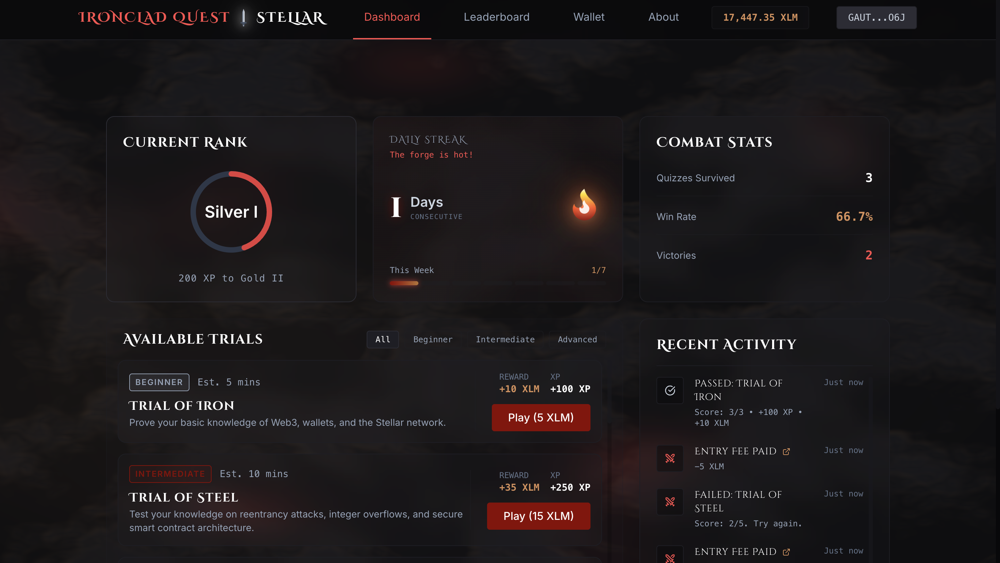
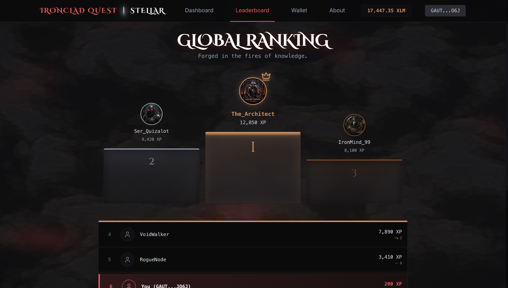
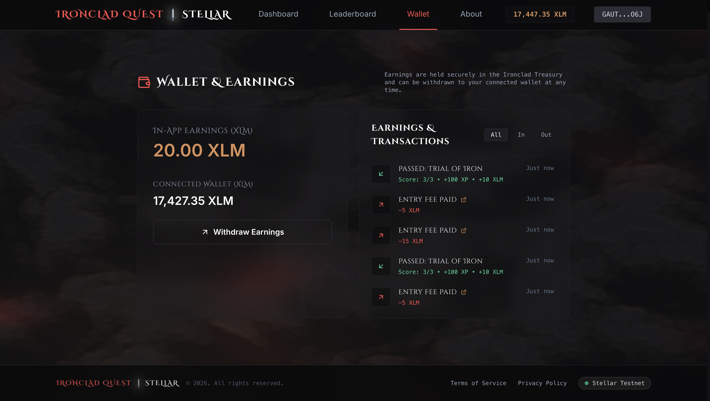
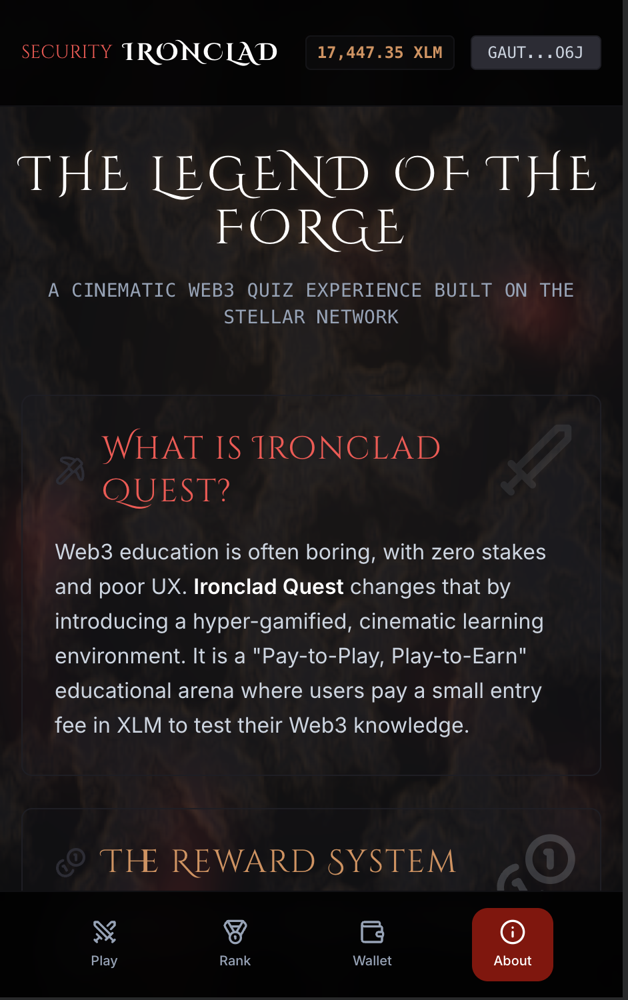
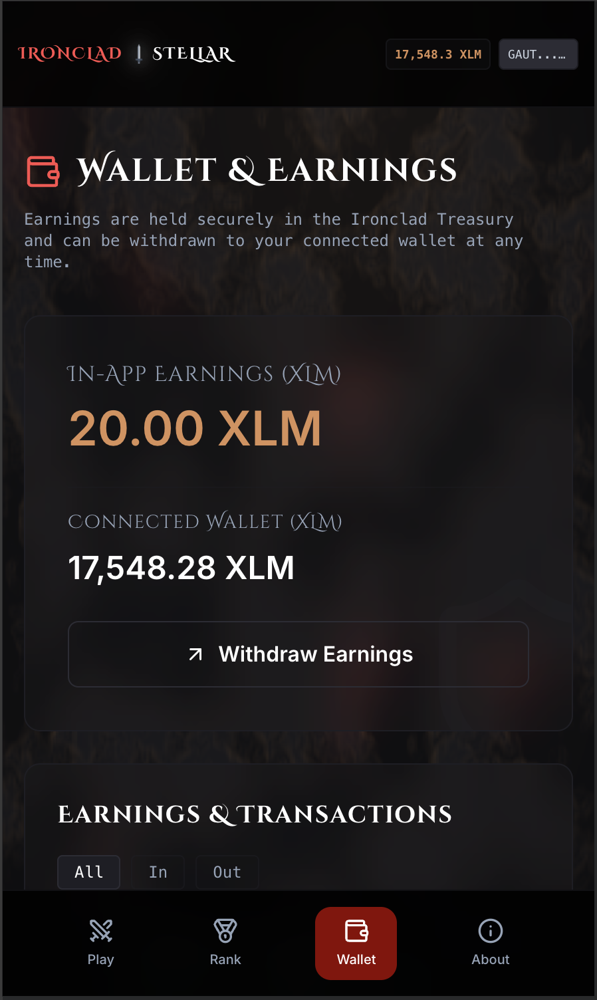
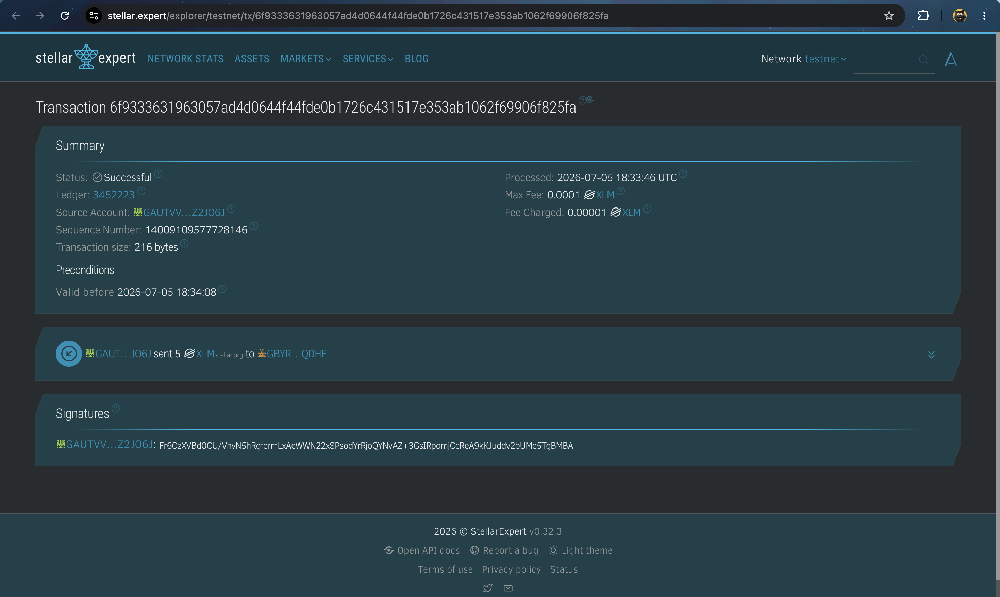
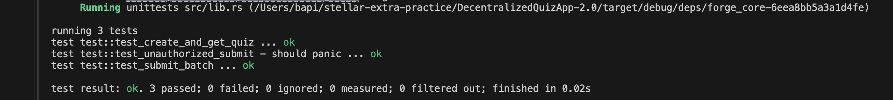
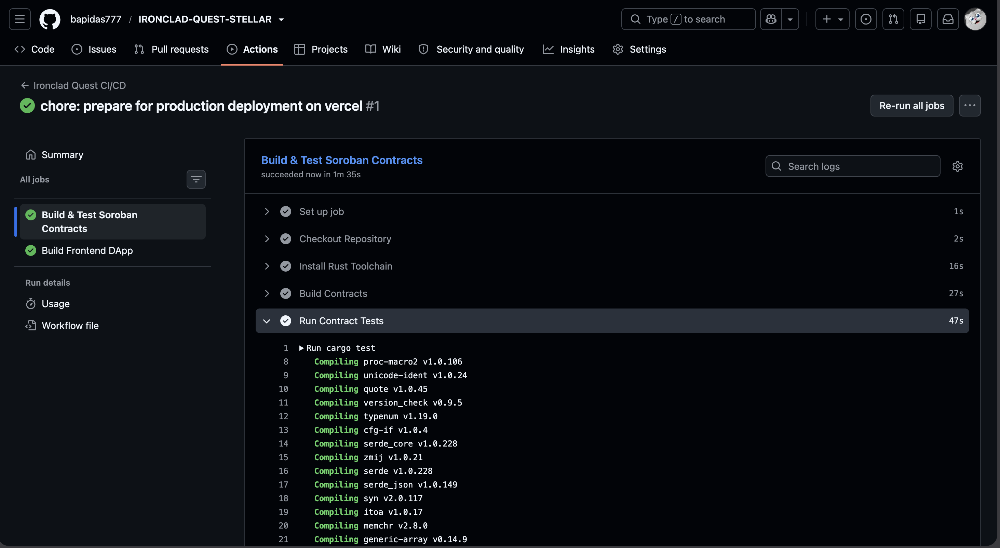

<div align="center">
  
# ༒︎ Ironclad Quest ༒︎ Stellar

**A Cinematic Web3 Quiz Experience forged on the Stellar Network using Soroban.**

[](https://github.com/bapidas777/IRONCLAD-QUEST-STELLAR/actions)
[](https://opensource.org/licenses/MIT)
[](https://stellar.org/)
[](https://soroban.stellar.org/)



*An entirely distinct Web3 quiz experience featuring a heavy metallic aesthetic, dark cinematic shading, and secure on-chain validation of quiz scores.*

</div>

---

## 📌 Submission Details & Quick Links

*   **🌐 Live Production Link**: [https://ironclad-quest-stellar.vercel.app/](https://ironclad-quest-stellar.vercel.app/)
*   **📹 Demo Video Presentation**: [https://youtu.be/VrlM1uB7XBk](https://youtu.be/VrlM1uB7XBk)
*   **💻 GitHub Repository**: [https://github.com/bapidas777/IRONCLAD-QUEST-STELLAR](https://github.com/bapidas777/IRONCLAD-QUEST-STELLAR)

---

## 📖 The Vision: Problem & Solution

### The Problem
Web3 onboarding and education platforms often suffer from a lack of true engagement:
1. **Zero Stakes**: Traditional quizzes have no real consequences, leading to low completion rates.
2. **Missing Rewards**: Users spend time learning about ecosystems without any tangible, immediate financial upside.
3. **Poor UX/UI**: Many decentralized applications feel clunky, unpolished, and lack the immersive gamification found in traditional Web2 games.

### The Solution: Ironclad Quest ༒︎ Stellar
We solve this by introducing a high-stakes, hyper-gamified learning environment:
- **Pay-to-Play Mechanics**: Users pay a small XLM entry fee via Freighter to attempt a Trial, raising the stakes.
- **On-Chain Treasury Rewards**: Passing a quiz instantly unlocks higher XLM rewards deposited directly into the user's in-app treasury, which can be withdrawn on-chain.
- **Verifiable Leaderboards**: High scores are validated and sorted mathematically by a Soroban Smart Contract, ensuring the Top 10 rankings cannot be manipulated.
- **Cinematic Polish**: Immersive WebGL shaders, fluid Framer Motion animations, and responsive mobile design create a premium Web3 gaming experience.

---

## 🌟 Progressive Features Built for Stellar

### 👛 Level 1: Core Connectivity & Direct Routing
*   **Multi-Wallet Bridge**: Smooth connection and disconnection handling using the Stellar Wallets Kit (Freighter).
*   **Balance Polling**: Real-time display of connected account balances and in-game treasury XLM.
*   **Direct Payments**: Secure, validated transfer modules supporting entry fee payments and treasury withdrawals natively on the Stellar Testnet.

### ⛓️ Level 2: Inter-Contract State Machine
*   **Forge Contract Architecture**: 
    *   Stores encrypted quiz batches and correct answers.
    *   Validates submitted answers against the on-chain mapping.
*   **Dynamic Leaderboard**: The contract utilizes a custom descending bubble-sort algorithm to strictly maintain a Top 10 leaderboard updated in real-time.
*   **Inter-Contract Invocations**: Auto-invokes the native Stellar Asset Contract to handle the transfer of XLM when entry fees are paid.

### 📡 Level 3: Event Logs, Tests, and CI/CD Pipelines
*   **Real-time Event Logging**: The smart contract emits Soroban events for `enter` (paying fees), `correct` (answering questions), and `leader` (breaking into the high scores).
*   **Comprehensive Testing**: Cargo Unit Tests validating lifecycle logic, answer validation, and complex leaderboard sorting.
*   **CI/CD Pipeline**: GitHub Action workflows (`ironclad-workflow.yml`) automating contract compilation, Rust testing, and Vite production builds.

---

## 📸 Interface Showcase

### Desktop Experience

<details open>
<summary><b>Global Leaderboard (Hall of Heroes)</b></summary>
<br>


</details>

<details open>
<summary><b>Wallet & Transaction History</b></summary>
<br>


</details>

### Mobile Responsiveness
*Our dark forge aesthetic seamlessly adapts to any mobile device.*

<div style="display: flex; gap: 10px;">
  
  
</div>

---

## 🛡️ Smart Contract Architecture & Validation

### Deployed Contracts & Credentials
*   **Forge Core Contract ID**: `CASYXS2TY4HMNTQQ53R5AKNJCMR3LCDLLQBAV4TTR6U4JELZM24J6VC4`
*   **Stellar Network**: Testnet
*   **Example Transaction Hash**: `1055f381cc487cae37e70d6c3627dadf9da00c0337180a185127d5b1ee7c30b9`



### Verified Test Suite
Running tests inside `contracts/forge-core` successfully executes all edge cases and Soroban lifecycle validations perfectly:



---

## ⚙️ Professional CI/CD Pipeline
Our GitHub Actions workflow automatically builds the Vite React frontend, compiles the Rust contracts to WebAssembly, and runs cargo tests upon pushing commits to the main repository.



---

## 🛠️ Technology Stack
*   **Frontend**: React + Vite + TypeScript + Tailwind CSS + Framer Motion
*   **Contracts**: Rust (Soroban SDK `20.0.1`)
*   **Stellar Integration**: `@creit.tech/stellar-wallets-kit`, `@stellar/freighter-api`
*   **Testing**: Cargo test for Rust contracts

---

## 💻 Local Installation & Getting Started

### 📋 Prerequisites
*   Node.js 20+
*   Cargo + Rust Toolchain (with `wasm32-unknown-unknown` target)
*   Soroban CLI
*   Freighter Wallet extension installed

### 🛠️ Step-by-Step Setup

1. **Clone the Repository**:
   ```bash
   git clone https://github.com/bapidas777/IRONCLAD-QUEST-STELLAR.git
   cd IRONCLAD-QUEST-STELLAR
   ```

2. **Install Frontend Dependencies**:
   ```bash
   npm install
   ```

3. **Run the Development Server**:
   ```bash
   npm run dev
   ```

4. **Run the Smart Contract Tests**:
   ```bash
   cd contracts/forge-core
   cargo test
   ```

5. **Deploy the Smart Contract**:
   Configure your Soroban CLI with a funded Testnet identity, then run:
   ```bash
   chmod +x scripts/deploy.sh
   ./scripts/deploy.sh
   ```

---

<div align="center">
  <b>Developed with ⚔️ by Bapi Das</b><br>
  <a href="https://github.com/bapidas777">GitHub Profile</a>
</div>
